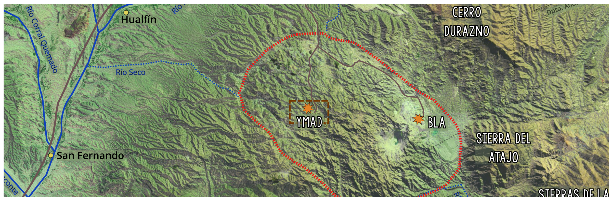
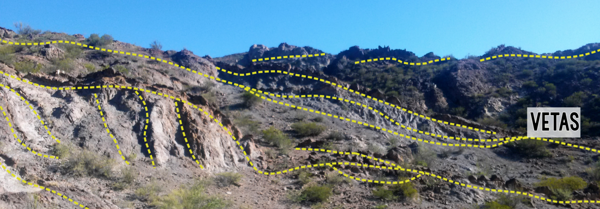
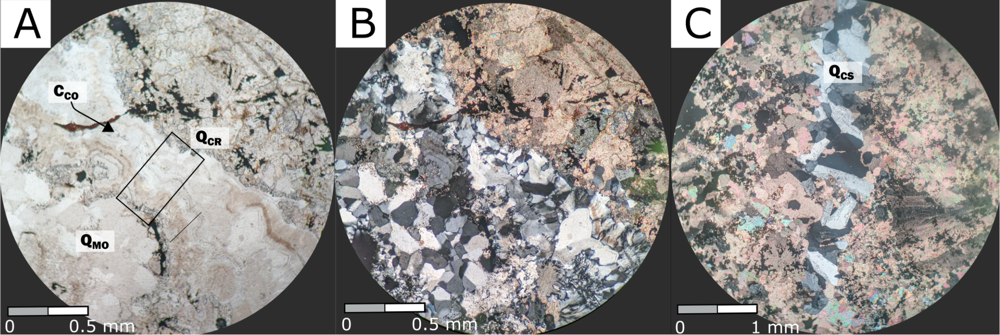

Geologic, Geochemical and Structural Characterization of the Los Viscos Vein in the Farallón Negro Volcanic Complex, Catamarca, Argentina
------------
### *2019-2020 - Universidad de Buenos Aires, Argentina*

*Figure 1. Farallón Negro Volcanic Complex location*

As part of my undergraduate research I worked along [Carolina Mendez](https://www.researchgate.net/profile/Carolina_Mendez4) and [Diana Irene Mutti](https://www.researchgate.net/profile/Diana_Mutti) in the a complete characterization of the Los Viscos Vein in the Farallón Negro Volcanic Complex (FNVC). The main objective was to determine the vein's geochemical, geological, and structural details and to determine its relationship with the  other mineralized deposits present at the Agua de Dionisio mining district. 

Due to the COVID pandemic the senior thesis presentation and its defense were done via Zoom in June 2002. A subsequent paper with detailed analyses of the quartz textures was presented at the [XII Argentinian Economic Geology Congress](https://www.aage.org.ar/actas/), held virtually in October 2020.

*Figure 2. View of the Los Viscos Vein in the studies area*

The Farallon Negro Volcanic Complex is comprised of a series of stratovolcanoes in the Catamarca Province, Argentina. These volcanic centers had been active during the Miocene (about 9-8 million years ago), but subsequent erosion removed most of the volcanic apparatus, exposing the underlying structure, including subvolcanic intrusions. Some of the region's most important mining operations are genetically linked with this event, such as the Cu-Mo Bajo de la Alumbrera and the Agua de Dionisio Au-veins (where the research was performed). The complex system of veins was defined as a intermidiate-sulphidation, Au-rich epithermal deposit.

*Figure 3. a. Los Viscos Vein studied area map; b. Example of the Nicholson geochemical analyis perfored; c. Photograph of the Los Viscos Vein notice the different colors between the country rock hydrotermally alterated (orange) and the veins (black)*

The study was performed in a 6000km2 area in the SW portion of the Los Viscos Vain. The field trip focused primarily on the recollection of samples from all three different lithologies present (the hydrothermal vein, country rock, and dike) as well as the measurement of their structural characteristics. A total of 29 microscopic cuts were analyzed, and 11 samples were sent to Canada for geochemical characterization. Once results were obtained, the lithological and hydrothermal maps of the area were drawn.

*Figure 4. Microscopic photography of the los Viscos Vein*

 
The vein is composed primarily of quartz, carbonates and Mn-oxides, with secondary silver sulfosalt minerals such as  acanthite- argentite, proustite, low sulfides, pyrite, and native elements, gold and silver. Secondary minerals include iron and managanese hydroxides. The more detailed studied of the silica and their textures allowed to make new contributions about the deposition of the precious metals. These seem to be associated with a late- hydrothermal stage of gel silica. 

The vein's rosette diagrams determined the main stressed to be NW-SE with a 60° dip average, with a latter variation associated with the dike orientation.

The hydrothermal alteration was characterized regionally as propillitic-phillic with an argillic imprint close to the veins. Therefore, the fluids that gave rise to the epithermal system ranged in temperature between 100-300°C and slightly acidic to neutral pH. 

Lastly, the geochemical results were used to determine the enrichment factor of the veins by using the MacLean (1990, 1993), and Gressen & Grant (1967, 1986) methods. Precious metals had a concentration of over 100% when compared to the regionally propillitic country rock (there is no data for unaltered country rock). Following previous works done by Llambias in the '70s, the origin of the manganese minerals was determined through the Nicholson (1992) method. Concluding some of the manganese minerals are primarily in origin. Further studies need to be performed to determine which ones. 

The structural and geochemical results were compared with the works of Wernert (2018) and Martinez et al. (2014), and a commonality in origin was drawn as a conclusion between both deposits. 

*Selected Publications:*

- Ninni, M.M., and Mendez C.C. (2020). *Hydrothermal Quartz Textural Analysis of Los Viscos Vein in the Farallón Negro Volcanic Complex, Catamarca, Argentina.* XII Congreso Argentino de Geologia Económica. [`pdf`](https://drive.google.com/file/d/1Apxt0jZECa7j4mfTqfuyGVcUsagl0VJz/view?usp=sharing) [`RG`](https://www.researchgate.net/publication/347948976_Analisis_Textural_De_La_Silice_Hidrotermal_En_La_Veta_Los_Viscos_Del_Complejo_Volcanico_Farallon_Negro_Catamarca_Argentina)
- Ninni M.M. (2020). *Geologic, Geochemical and Structural Characterization of the Los Viscos Vein in the Farallón Negro Volcanic Complex, Catamarca, Argentina.* - Undergraduate Senior Thesis - Thesis directors: Dra. Diana Irene Mutti and Dra. Carolina Carmen Mendez. Ore Deposits and Economical Geology Department, UBA. (DOI: 10.13140/RG.2.2.20814.89923)
[`pdf`](https://drive.google.com/file/d/1AkX23Grf_VeDCpRQQZ1qXib9Wr_IXu8N/view?usp=sharing) [`RG`](http://localhost:1313/cv/#profile)

